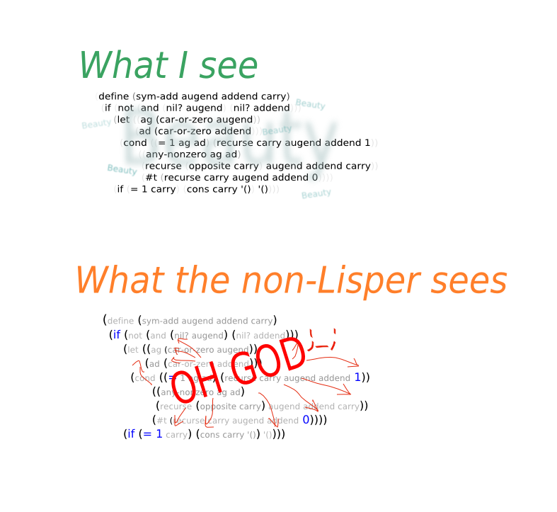

# A face dedicated to lisp parentheses

This library defines a face named `parenthesis` used just for
parentheses and that only in lisp buffers.  The intended purpose
of this face is to make parentheses less visible by dimming them.

We lispers probably don't need to be constantly made aware of the
existence of the parentheses.  Dimming them might be even more
useful for people new to lisp who have not yet learned to
subconsciously blend out the parentheses.

To use the `parenthesis` face, turn on `global-paren-face-mode`.
The option `paren-face-modes` controls in what buffers the minor
mode `paren-face-mode` is turned on.

The parenthesis at or before point, as well as the parenthesis at
the other end of the s-expression should actually stand out, but
that is beyond the scope of the mode defined here.  Instead use one
of the modes dedicated to that, e.g. the builtin `show-paren-mode`.

## History

Dave Pearson's `parenface.el` implements the same basic idea.
Unfortunately that library doesn't use the appropriate Emacs
interfaces correctly, so I wrote this as a replacement.

